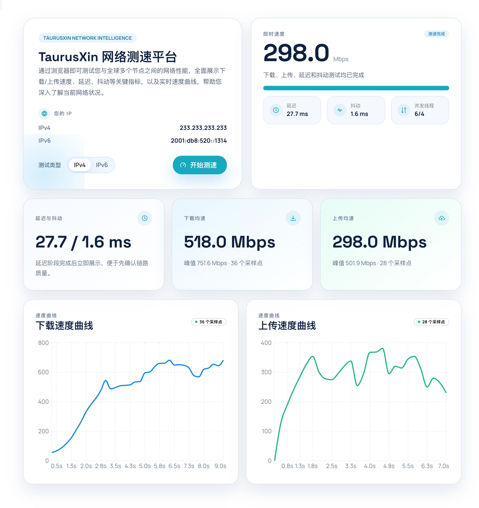

# Speedtest Next


一个基于 Go + React 的在线网络测速平台，支持 IPv4 / IPv6 双栈切换、延迟与抖动测试、下载/上传测速，以及前端曲线展示。



## 特性

- Go 单服务提供测速 API 与前端静态资源
- React + Mantine 前端，自动跟随浏览器亮色 / 暗色主题
- IPv4 / IPv6 双栈测速切换
- 延迟、抖动、下载、上传分阶段测速
- 下载 / 上传分离图表展示
- 前端资源可嵌入到 Go 二进制中，部署时只需一个可执行文件

## 项目结构

```text
.
├── main.go                  # Go 服务入口，测速 API、静态资源托管、CORS、日志
├── main_test.go             # Go 服务基础测试
├── Dockerfile               # Docker 多阶段构建
├── compose.yaml             # Docker Compose 部署配置
├── deploy/systemd/          # systemd 服务配置
├── web/                     # React 前端
│   ├── src/
│   │   ├── App.tsx          # 页面与交互
│   │   ├── App.css          # 页面样式
│   │   ├── config.ts        # 前端测速参数与目标域名配置
│   │   ├── main.tsx         # Mantine 主题与前端入口
│   │   ├── speedtest.ts     # 前端测速逻辑
│   │   └── index.css        # 全局样式与亮暗主题变量
│   └── package.json
└── docs/ARCHITECTURE.md     # 架构与测速逻辑说明
```

## 环境要求

- Go 1.26+
- Node.js 20+
- `pnpm`

依赖管理约定：

- Node.js 项目使用 `pnpm`
- 如果后续引入 Python 辅助脚本，使用 `uv`

## 本地开发

前端安装依赖：

```bash
cd web
pnpm install
```

启动前端开发环境：

```bash
cd web
pnpm dev
```

启动 Go 服务：

```bash
go run .
```

默认情况下：

- 前端开发服务器运行在 `http://localhost:5173`
- Go 服务运行在 `http://localhost:8080`

## 构建

先构建前端：

```bash
cd web
pnpm build
```

再构建 Go 二进制：

```bash
cd ..
go build
```

说明：

- Go 会通过 `embed` 将 `web/dist` 打包进最终二进制
- 如果前端未先构建，最终二进制将不会包含最新页面资源

## 配置

前端测速参数位于 [web/src/config.ts](./web/src/config.ts)：

- `apiTargets`：IPv4 / IPv6 测速目标
- `download` / `upload`：并发数、时长、块大小
- `samplingIntervalMs`：采样间隔
- `chartPointsLimit`：图表最大点数
- `displaySmoothingFactor`：展示层平滑系数

如果 `apiTargets` 中只写域名、不带协议，前端会自动使用当前页面协议补全。

## 运行时环境变量

Go 服务支持以下环境变量：

- `SPEEDTEST_ADDR`：监听地址，默认 `:8080`
- `SPEEDTEST_STATIC_DIR`：可选，指定外部静态目录；设置后会覆盖嵌入资源
- `SPEEDTEST_LOG_NOISY_API`：是否输出高频测速接口访问日志，默认 `false`
- `SPEEDTEST_TARGET_IPV4`：必填，IPv4 测速目标域名或完整地址
- `SPEEDTEST_TARGET_IPV6`：必填，IPv6 测速目标域名或完整地址
- `SPEEDTEST_LATENCY_SAMPLE_COUNT`：可选，默认 `10`
  延迟测试采样次数。次数越多，平均延迟和抖动越稳定，但测速开始前等待时间也会更长。
- `SPEEDTEST_LATENCY_SAMPLE_GAP_MS`：可选，默认 `160`
  两次延迟采样之间的间隔，单位毫秒。间隔更大时，抖动观察更充分，但整体延迟阶段更慢。
- `SPEEDTEST_DOWNLOAD_CONCURRENCY`：可选，默认 `6`
  下载测试并发线程数。数值越大，越容易打满带宽，但也会提升服务端和浏览器压力。
- `SPEEDTEST_DOWNLOAD_DURATION_MS`：可选，默认 `9000`
  下载测试持续时间，单位毫秒。时间越长，结果通常越稳定。
- `SPEEDTEST_DOWNLOAD_CHUNK_BYTES`：可选，默认 `6291456`
  单个下载请求的数据块大小，单位字节，默认约 `6 MiB`。块越大，请求切换越少。
- `SPEEDTEST_UPLOAD_CONCURRENCY`：可选，默认 `4`
  上传测试并发线程数。通常上传带宽较小，默认值会低于下载并发。
- `SPEEDTEST_UPLOAD_DURATION_MS`：可选，默认 `7000`
  上传测试持续时间，单位毫秒。
- `SPEEDTEST_UPLOAD_CHUNK_BYTES`：可选，默认 `1048576`
  单个上传请求的数据块大小，单位字节，默认约 `1 MiB`。
- `SPEEDTEST_SAMPLING_INTERVAL_MS`：可选，默认 `250`
  前端统计瞬时速度的采样间隔，单位毫秒。越短越灵敏，但曲线抖动也通常越大。
- `SPEEDTEST_CHART_POINTS_LIMIT`：可选，默认 `120`
  前端图表最多保留的采样点数量，用于限制曲线长度和渲染开销。
- `SPEEDTEST_DISPLAY_SMOOTHING_FACTOR`：可选，默认 `0.35`
  展示层平滑系数，用于平滑瞬时速度和曲线。值越大越跟随实时变化，值越小越平滑。

说明：

- `SPEEDTEST_TARGET_IPV4` 和 `SPEEDTEST_TARGET_IPV6` 缺失时，服务不会启动
- 其它测速参数均为可选，不传时使用内置默认值
- 前端启动后会从后端 `/api/v1/runtime-config` 读取这些配置，因此即使前端是静态资源，也能在容器运行时动态生效

## Docker 镜像

构建镜像：

```bash
docker build -t speedtest-next .
```

运行示例：

```bash
docker run --rm -p 8080:8080 \
  -e SPEEDTEST_TARGET_IPV4=speedtest-v4only.taurusxin.com \
  -e SPEEDTEST_TARGET_IPV6=speedtest-v6only.taurusxin.com \
  speedtest-next
```

带可选测速参数的示例：

```bash
docker run --rm -p 8080:8080 \
  -e SPEEDTEST_TARGET_IPV4=speedtest-v4only.taurusxin.com \
  -e SPEEDTEST_TARGET_IPV6=speedtest-v6only.taurusxin.com \
  -e SPEEDTEST_DOWNLOAD_CONCURRENCY=8 \
  -e SPEEDTEST_UPLOAD_CONCURRENCY=6 \
  -e SPEEDTEST_DOWNLOAD_CHUNK_BYTES=8388608 \
  -e SPEEDTEST_UPLOAD_CHUNK_BYTES=2097152 \
  -e SPEEDTEST_SAMPLING_INTERVAL_MS=300 \
  speedtest-next
```

## 部署方式

### 方式一：systemd 守护进程

适合直接上传二进制到服务器，用系统服务托管。

1. 在构建机执行：

```bash
cd web && pnpm build
cd ..
go build -o speedtest-next
```

2. 上传二进制到服务器，例如：

```bash
sudo mkdir -p /opt/speedtest-next
sudo cp speedtest-next /opt/speedtest-next/
sudo chmod +x /opt/speedtest-next/speedtest-next
```

3. 创建环境变量文件：

```bash
sudo mkdir -p /etc/speedtest-next
sudo cp deploy/systemd/speedtest-next.env.example /etc/speedtest-next/speedtest-next.env
```

然后编辑：

```bash
sudo nano /etc/speedtest-next/speedtest-next.env
```

至少填写：

```bash
SPEEDTEST_TARGET_IPV4=speedtest-v4only.taurusxin.com
SPEEDTEST_TARGET_IPV6=speedtest-v6only.taurusxin.com
```

4. 安装并启用服务：

```bash
sudo cp deploy/systemd/speedtest-next.service /etc/systemd/system/speedtest-next.service
sudo systemctl daemon-reload
sudo systemctl enable --now speedtest-next
```

5. 查看状态：

```bash
sudo systemctl status speedtest-next
sudo journalctl -u speedtest-next -f
```

相关文件：

- 服务文件：[deploy/systemd/speedtest-next.service](./deploy/systemd/speedtest-next.service)
- 环境变量模板：[deploy/systemd/speedtest-next.env.example](./deploy/systemd/speedtest-next.env.example)

### 方式二：Docker Compose

适合容器化部署，配置通过 `.env` 注入。

1. 复制环境变量模板：

```bash
cp .env.example .env
```

2. 编辑 `.env`，至少填写：

```bash
SPEEDTEST_TARGET_IPV4=speedtest-v4only.taurusxin.com
SPEEDTEST_TARGET_IPV6=speedtest-v6only.taurusxin.com
```

3. 构建并启动：

```bash
docker compose up -d --build
```

4. 查看日志：

```bash
docker compose logs -f
```

5. 停止服务：

```bash
docker compose down
```

相关文件：

- Compose 文件：[compose.yaml](./compose.yaml)
- 环境变量模板：[.env.example](./.env.example)

两种方式的共同点：

1. 都必须提供 `SPEEDTEST_TARGET_IPV4` 和 `SPEEDTEST_TARGET_IPV6`
2. 其它测速参数都可以不传，服务会自动回退到默认值
3. 生产环境通常仍建议在前面加 nginx 做域名、TLS 和反向代理

## 说明

- 浏览器无法在同一主机名下强制指定 IPv4 或 IPv6，所以双栈切换依赖不同域名
- 曲线与即时速度使用展示层平滑，最终测速结果仍然按累计字节数和总时长计算

更详细的架构和请求流说明见 [docs/ARCHITECTURE.md](./docs/ARCHITECTURE.md)。
